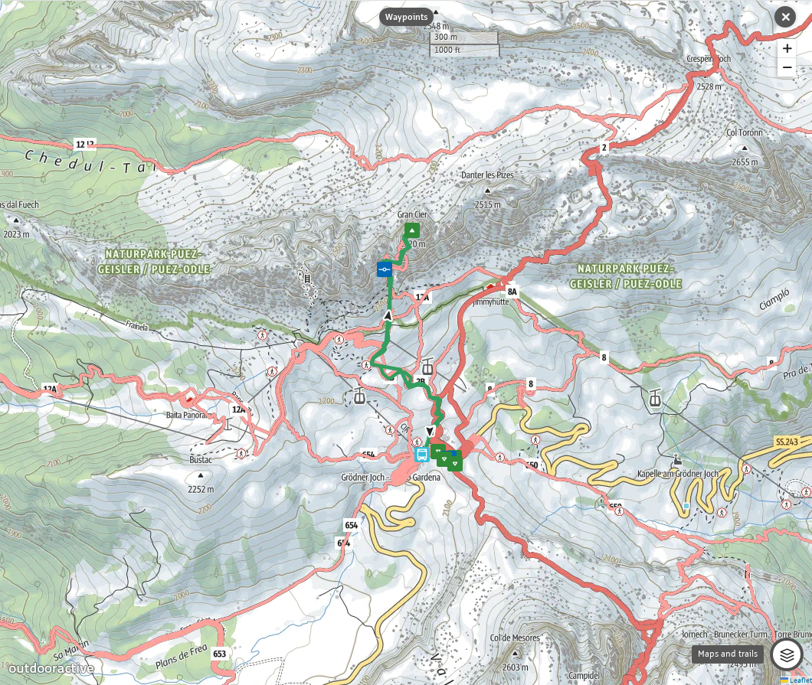
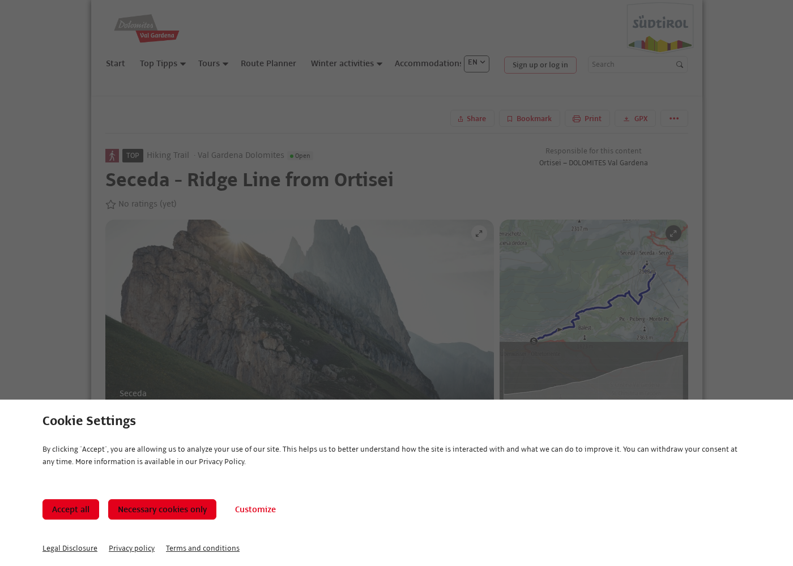
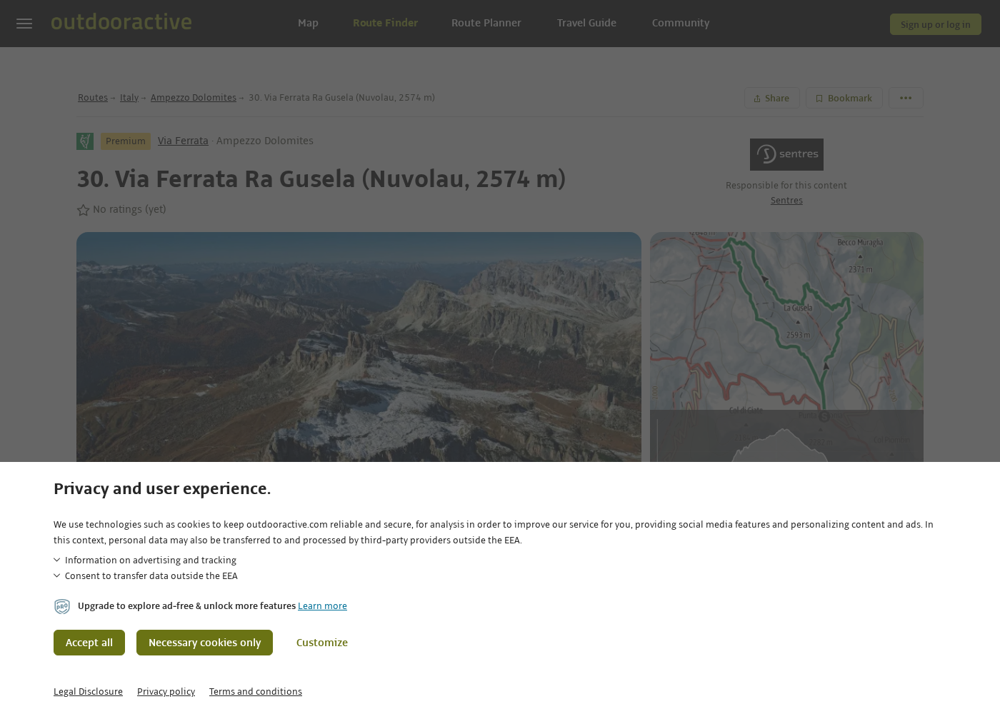
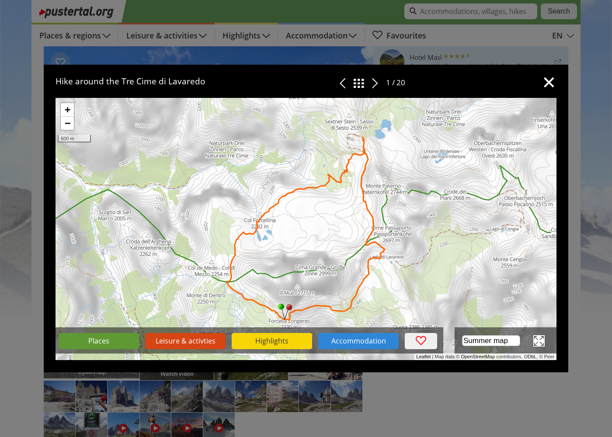

# Trip plan — Dolomites Core (31 Aug – 6 Sep 2026)

7-day camping road trip from **Bergamo Airport (BGY)**. Focus: **beginner via ferrata** (grade A, fully protected), no hard unprotected scrambling.

**Travellers assumed:** 5 people, tent(s) + rental car. Adjust pitch count if using multiple tents.

**Driving rule:** **≤150 km per day** on move and activity days. **Day 2** is the main transfer (**~125 km** Iseo → Colfosco). Western base **Camping Colfosco** is **~8 km** from Passo Gardena (Gran Cir). Day 1 is a short hop to **Lake Iseo** (~26 km from BGY). Return to BGY may exceed 150 km on Day 7 unless staged (see Day 7).

**Budget:** see [BUDGET.md](BUDGET.md) — total **~€950–1,450** excluding flights (7 days, 5 people). Car hire from **~€200** via Italian brands at BGY.

**Equipment:** see [EQUIPMENT.md](EQUIPMENT.md).

**All links:** see [SOURCES.md](SOURCES.md).

**Activity rules:** [PRINCIPLES.md](../PRINCIPLES.md)

---

## Calendar

| Day | Date | Overnight | Main activity | Drive (km) |
|-----|------|-----------|---------------|------------|
| 1 | **Sat 31 Aug** | **Camping del Sole**, Lake Iseo | Arrive BGY → arrival camp | **~26** |
| 2 | **Sun 1 Sep** | **Camping Colfosco**, Corvara | Transfer → acclimatise | **~125** |
| 3 | **Mon 2 Sep** | Colfosco | **Via Ferrata Gran Cir** | **~16** RT |
| 4 | **Tue 3 Sep** | Colfosco | **Seceda ridge** (cable car) | **~30** RT |
| 5 | **Wed 4 Sep** | **Camping Olympia**, Dobbiaco | Transfer → **Via Ferrata Ra Gusela** | **~63** + **~50** RT |
| 6 | **Thu 5 Sep** | Olympia | **Tre Cime di Lavaredo** loop | **~35** RT |
| 7 | **Fri 6 Sep** | — | Drive to BGY (direct or staged) | **~290** or **~140** |

**Camping nights:** 6 (1 Iseo + 3 Colfosco + 2 Olympia).

---

## Why these dates work

- **31 Aug:** Last day of August — Ferragosto crowds mostly gone; infrastructure still fully open.
- **1–6 Sep:** Early September — often **clearer weather**, fewer afternoon storms than peak August ([Dolomites Journey](https://www.dolomitesjourney.com/dolomites-travel-tips/best-time-to-visit-dolomites), [September guide](https://www.moonhoneytravel.com/hiking-dolomites-september/)).
- All rifugi, passes, and cable cars open through your dates.
- **Braies** (optional from Dobbiaco by bus 442) if Tre Cime weather fails on **5 Sep** — car access 09:00–16:00 restricted 1 Jul–15 Sep ([prags.bz](https://www.prags.bz/en)).

**Weather checks (evening before each hike):**
- Val Badia / Gardena: [Meteo Alto Adige](https://weather.provinz.bz.it/)
- Cortina / Tre Cime: [Dolomiti Meteo ARPAV](https://www.dolomiti-meteo.com/)
- Guide: [Hikes in the Dolomites — weather](https://www.hikesinthedolomites.com/weather/)

**Ferrata rule:** If thunderstorms forecast after 12:00, skip exposed routes.

---

## Driving & campsite strategy

### 150 km/day rule

| Leg | km | Notes |
|-----|-----|-------|
| BGY → Lake Iseo (Camping del Sole) | ~26 | Day 1 — gentle arrival ([26 km from BGY](https://camplinq.com/camps/camping-del-sole-village/)) |
| Iseo → Colfosco (Corvara) | ~125 | Day 2 — A4 → A22 → Bressanone/Val Pusteria → SS244; **one long transfer** |
| Colfosco → Passo Gardena (Gran Cir) | ~8 one way | **~16 km** RT — closest full camp to ferrata |
| Colfosco → Ortisei (Seceda lift) | ~15 one way | **~30 km** RT |
| Colfosco → Dobbiaco (Olympia) | ~63 | Day 5 move ([Corvara–Dobbiaco ~63 km](https://www.percorsokm.it/it-it/percorso-da-Dobbiaco-a-Corvara_in_Badia)) |
| Olympia → Passo Giau / Tre Cime | 15–20 one way | Activity days |
| Dobbiaco → BGY (direct) | ~290 | Day 7 — **over daily cap** |
| Dobbiaco → Sarche / Iseo (exit staging) | ~140 / ~99+ | Optional split return |

**Why Iseo + Colfosco:** Short day 1 after flying; **Camping Colfosco** saves **~15 km/day** vs San Vigilio (Al Plan) for Gran Cir and Seceda. Cinque Torri dropped from departure day to allow an earlier start on the drive home.

### Campsites — trailhead proximity

Wild camping is **illegal** in Dolomites nature parks.

| Base | Nights | Campsite | Closest hikes | Drive to trailhead |
|------|--------|----------|---------------|-------------------|
| Staging | 31 Aug | **Camping del Sole**, Lake Iseo | Arrival camp | — |
| Alta Badia | 1–3 Sep | **Camping Colfosco**, Corvara/Colfosco | Gran Cir, Seceda | **8–15 km** |
| Alta Pusteria | 4–5 Sep | **Camping Olympia**, Dobbiaco | Ra Gusela, Tre Cime, Braies bus | **15–25 km** |

| Camp | Book |
|------|------|
| Iseo | [campingdelsole.it](https://www.campingdelsole.it/en/) |
| Colfosco | [campingcolfosco.org](https://www.campingcolfosco.org/) |
| Olympia | [camping-olympia.com](https://www.camping-olympia.com/en/lago-di-braies-camping/) |

**Campsite map:** [45 sites — interactive map](https://mountainsforeverybody.com/campsites-in-the-dolomites-interactive-map/)

**Olympia advantage:** ~15 min to Braies shuttle (bus 442), Tre Cime shuttle (Line 444 from Dobbiaco), and Passo Giau — one base for the whole eastern block without daily camp moves.

**5 people:** book a **large pitch** or **two adjacent pitches**; confirm extra-adult fees when booking Colfosco and Olympia.

**Scenic approach?** [Garda–Iseo Corridor](../version-b/PLAN.md) covers Riva, Arco, and Valle dei Laghi over 5 days — then join Dolomites via Bressanone ([README](../version-b/README.md)).

**Strict ≤100 km/day for the full trip?** Not compatible with 7 days from BGY — use [Garda–Iseo Corridor](../version-b/PLAN.md) as a scenic approach with extra nights, or fly closer (Verona / Bolzano).

---

## Logistics overview

### Car hire — yes, recommended

| | |
|---|---|
| **Pick up / drop off** | **BGY airport** (recommended) or Bergamo city — see [BUDGET.md § Car hire](BUDGET.md#1-car-hire--bergamo-bgy--local-alternatives) |
| **Type** | **Estate / compact SUV / MPV** — 5 people + tent kit |
| **Cost** | **€200–490** for 7 days — Italian brands (Locauto, Sicily by Car) often **€50–150 below** Sixt/Hertz |
| **Compare** | [DiscoverCars](https://www.discovercars.com/) · [Rent.it BGY](https://www.rent.it/autonoleggio/italia-1/bergamo-34/bergamo_aeroporto_orio_al_serio_bgy-42/) · [Sicily by Car](https://www.sicilybycar.it/it/noleggio-auto/italia/aeroporto-bergamo) |
| **Why** | Camping gear, ferrata trailheads, Tre Cime parking needs **license plate** |

**Local sellers:** Autodiretto, FB65, BJ Auto in Bergamo city can undercut airport majors — but you need a **bus/taxi from BGY** (~€3–35) and must match **Saturday opening hours** (31 Aug). Only choose city pickup if the quote saves **>€50** vs an Italian brand at the airport desk.

All links: [SOURCES.md — Car hire](SOURCES.md#car-driving--airports)

### Total driving (estimate)

~**750–900 km** for the week (well below the 150 km × 7 = 1,050 km ceiling if you split the return).

---

## Day 1 — Sat 31 Aug: Arrival at Lake Iseo

### Mountain

| Time | Activity |
|------|----------|
| Morning / midday | Land BGY, collect rental car |
| Afternoon | Drive to Lake Iseo (**~26 km**, ~35 min via A4 Rovato exit), check in Camping del Sole |

No mountain route today — travel day only.

### Recovery

| Time | Activity |
|------|----------|
| Late afternoon | Optional **swim** at del Sole lakeside beach (~30 min) |

### Logistics

| Time | Activity |
|------|----------|
| Evening | **Provision run** — supermarket in Iseo (~20 min) for days 1–2 |

### Costs today

| Item | € |
|------|---|
| Car hire (daily share) | ~€36–70 |
| Motorway tolls (partial) | ~€3–5 |
| Fuel (partial) | ~€5–10 |
| Campsite night 1 | ~€50–80 (5 people) |

### Watch

- Easy first day — valley altitude ~200 m. No mountain hiking.
- Supermarket in Iseo is a 10 min walk from camp (for provisioning only).

---

## Day 2 — Sun 1 Sep: Into Alta Badia (Colfosco)

### Mountain

| Time | Activity |
|------|----------|
| Afternoon | Easy **valley walk** from camp — acclimatise to **~1,500 m** |

### Logistics

| Time | Activity |
|------|----------|
| 07:30 | Leave Iseo |
| 10:30–11:00 | Arrive **Camping Colfosco** (**~125 km**, A4 → A22 → Bressanone → SS49/SS244 to Corvara) |
| Midday | Pitch tent, **provision run** in Corvara (~20 min) |

### Costs today

| Item | € |
|------|---|
| Motorway tolls | ~€18–25 |
| Fuel (partial) | ~€20–30 |
| Campsite night 2 | ~€45–70 pitch + electricity |

### Watch

- **Longest drive day** of the trip — start early, fuel on A22.
- No via ferrata today.
- Buy food in Corvara before Sunday evening closures.

---

## Day 3 — Mon 2 Sep: Via Ferrata Gran Cir

**Main ferrata day.** Grade **A** — easiest classic in the Dolomites; mostly a protected hike.

### Schedule

| Time | Activity |
|------|----------|
| 07:00 | Leave camp (**~8 km** to Passo Gardena) |
| 07:45 | Arrive Passo Gardena (2,121 m) |
| 08:00–11:30 | Gran Cir (+ optional Pitla Cir) |
| Afternoon | Rest at camp — save Braies for tomorrow |

### Route

| | |
|---|---|
| **Start** | Passo Gardena — park at pass or Dantercepies lift area |
| **Duration** | 1–1.5 h up Gran Cir; +1 h for Pitla Cir |
| **Grade** | A (beginner) |
| **Gear** | Helmet, harness, via ferrata lanyard — rent locally |

### Gear rental (pick up morning of 2 Sep)

| Shop | Price | Link |
|------|-------|------|
| Alta Badia Sport, La Villa | **€20/day** (set) | [altabadiasport.it](https://altabadiasport.it/en/bike-rental-alta-badia/via-ferrata-set) |
| INTERSPORT Val Gardena, Selva | **€27/day** | [valgardenasport.com](https://www.valgardenasport.com/en/via-ferrata-set/) |
| Lagazoi rental | **€25/day** | [rent.lagazoi.it](https://rent.lagazoi.it/en/equipment-rental/9-via-ferrata-kit) |

Rent **2 days** (2–3 Sep) → **€40** total per set at Alta Badia Sport.

**Or bring own kit** bought in Poland — [EQUIPMENT.md Appendix A](EQUIPMENT.md#appendix-a--optional-buying-ferrata-kits-in-poland).

**Optional guide (first-timers):** ~€250–350/group — [Guide Dolomiti](https://www.guidedolomiti.com/en/guided-via-ferrata-dolomites-with-a-local-expert/)

### Costs today

| Item | € |
|------|---|
| Ferrata kit rental (day 1 of 2) | 20–27 per set |
| Campsite night 3 | 45–70 |
| Rifugio lunch (optional) | 15–25/person |

### Sources — read & watch before

| Type | Link |
|------|------|
| **YouTube** | [Piccolo + Grande Cir ferrata](https://www.youtube.com/watch?v=TD8s1AjNJRI) |
| Official route | [Val Gardena — Gran Cir](https://www.valgardena.it/en/outdoor/base/outdoor/gran-cir-gran-cir-peak/810054754/) |
| Blog guide | [In A Faraway Land — Gran Cir](https://inafarawayland.com/via-ferrata-gran-cir/) |
| Beginner list | [13 beginner ferratas](https://inafarawayland.com/beginner-via-ferratas-italian-dolomites/) |

**Route map (marked ferrata):** [Val Gardena — interactive map](https://www.valgardena.it/en/outdoor/base/outdoor/gran-cir-gran-cir-peak/810054754/)

---

## Day 4 — Tue 3 Sep: Seceda ridge

**Rest day from ferrata** — iconic hike, **~30 km** driving RT from Colfosco.

### Schedule

| Time | Activity |
|------|----------|
| 07:30 | Drive to Ortisei (**~15 km**) |
| 08:00 | Seceda cable car up |
| 08:30–13:00 | Ridge walk toward Pierlongia / Regensburger Hütte viewpoint |
| Afternoon | Return to camp |

| Item | Cost |
|------|------|
| Seceda cable car return | ~€25–35/person |
| Drive | **~30 km** RT |

**YouTube:** [Seceda hike vlog](https://www.youtube.com/watch?v=E_Y8FI4Esd0)

**Route map (marked trail):** [Val Gardena Outdoor — Seceda ridge line](https://outdoor.valgardena.it/en/route/hiking-trail/seceda-ridge-line-from-ortisei/810055445/)

### Weather backup

Easy **Puez-Odle** viewpoint trail from Passo Gardena (**~16 km** RT) if Seceda is in cloud — no lift cost.

### Costs today

| Item | € |
|------|---|
| Campsite night 4 (last at Colfosco) | 45–70 |
| Seceda lift | 25–35/person |

---

## Day 5 — Wed 4 Sep: Move camp + Ra Gusela

### Schedule

| Time | Activity |
|------|----------|
| 08:00 | Pack camp, drive to Dobbiaco (**~63 km**, ~1 h 15 min) |
| 10:30 | Check in Camping Olympia |
| 12:00 | Late lunch, rest |
| 14:00 | Drive to Passo Giau (**~25 km**) |
| 14:30–17:30 | **Via Ferrata Ra Gusela** loop to Rifugio Nuvolau |

### Route — Ra Gusela

| | |
|---|---|
| **Grade** | A (beginner, family-friendly) |
| **Duration** | ~3 h loop |
| **Start** | Passo Giau (2,236 m) — path 443 → 438 |
| **Gear** | Same kit as day 3 — day 2 of 2-day rental |

### Costs today

| Item | € |
|------|---|
| Ferrata kit (day 2 of rental) | included in €40/set |
| Campsite night 5 | ~€36–50 |
| Braies (optional later from Dobbiaco by bus 442) | ~5–15/person |

### Sources

| Type | Link |
|------|------|
| **Video** | [Ra Gusela loop from Passo Giau](https://www.monti.uno/video_montagna/Interessante/ferrata_e_cima_ra_gusela_anello_dal_passo_giau/9/52486) |
| Official | [Cortina — Ra Gusela](https://cortina.dolomiti.org/en/vie-ferrate/via-ferrata-ra-gusela-en/) |

**Route map (marked ferrata):** [Outdooractive — interactive map](https://www.outdooractive.com/en/route/via-ferrata/ampezzaner-dolomiten/30.-via-ferrata-ra-gusela-nuvolau-2574-m-/58456823/)

---

## Day 6 — Thu 5 Sep: Tre Cime di Lavaredo

Classic **hike** (~10 km loop, 3–4 h) — no ferrata kit needed. High altitude (~2,300 m) but well-marked path.

### Schedule

| Time | Activity |
|------|----------|
| 06:30 | Leave camp (**~18 km** to toll road) |
| 07:00 | Arrive Rifugio Auronzo (booked slot) |
| 07:15–12:00 | Tre Cime loop (path 101 → Locatelli → Langalm → Auronzo) |
| Afternoon | Rest at camp |

### Access — book in advance

**Option A — Car (recommended with gear in vehicle)**

| Item | Cost | Book |
|------|------|------|
| Parking + toll road, 12 hours | **€40** | [pass.auronzo.info](https://pass.auronzo.info/) |
| Book entry slot | **07:00** | Opens ~1 month ahead — **5 Sep 2026** |

**Option B — Shuttle from Dobbiaco (Line 444)**

| Item | Cost | Book |
|------|------|------|
| Return ticket, adult | **€22** | [drei-zinnen.bz/ticket](https://www.drei-zinnen.bz/en/ticket) |

Shuttle runs **31 May – 11 Oct 2026**.  
**Prices:** [drei-zinnen.bz FAQ](https://www.drei-zinnen.bz/en/ticket) · [auronzo.info parking 2026](https://auronzo.info/en/parking-tre-cime-di-lavaredo/)

### Costs today

| Item | € |
|------|---|
| Tre Cime parking OR shuttle | 40 or 22/person |
| Campsite night 6 | 36–50 |
| Rifugio lunch on trail | 15–25/person |

### Sources

| Type | Link |
|------|------|
| **YouTube** | [Tre Cime loop hike](https://www.youtube.com/watch?v=1jmTOj_U3qQ) |
| 2026 guide + map | [Throne & Vine — Tre Cime](https://throneandvine.com/tre-cime-di-lavaredo-drei-zinnen-guide/) |
| Official visitor info | [auronzo.info](https://auronzo.info/en/tre-cime-di-lavaredo-dolomites/) |

**Route map (marked trail):** [Pustertal — Tre Cime circular hike map](https://www.pustertal.org/en/leisure-activities/mountains-and-hiking/hiking-in-alta-pusteria-three-peaks/tre-cime-di-lavaredo-circular-hike/) (click **Open map** on the page)

### Weather backup

**Lago di Braies** by bus 442 from Dobbiaco (~€5–15) if Tre Cime is in cloud.

---

## Day 7 — Fri 6 Sep: Departure

### Schedule

| Time | Activity |
|------|----------|
| 07:00 | Pack camp, check out Olympia |
| 07:30 | Start drive toward BGY |
| ~11:00–12:00 | Arrive BGY area (direct **~290 km**, ~3 h 30 min) |
| Afternoon | Return car, fly home |

**Cinque Torri** removed from this day — saves ~25 km and 3 h so you can leave earlier for the long drive.

### Return drive — options

| Option | Route | km | Best for |
|--------|-------|-----|----------|
| **A — Direct** | Dobbiaco → A22 → A4 → BGY | **~290** | Afternoon/evening flight; one long day |
| **B — Staged via Sarche** | Day 7: Dobbiaco → Sarche (~140 km), night camp; Day 8: Sarche → BGY (~145 km) | **≤150/day** | **Morning flight 7 Sep** — needs extra holiday day |
| **C — Staged via Iseo** | Day 7: Dobbiaco → Iseo area (~280 km split impossible in one day under 150) | — | Use Sarche or fly from Verona instead |

### Costs today

| Item | € |
|------|---|
| Fuel + tolls (return leg) | ~€55–75 |
| Car hire (final day) | included in total |

**Allow 3.5+ hours** Dobbiaco → BGY on Option A, plus fuel stop and car return.

---

## Via ferrata summary

Routes chosen for **full cable protection** — no long exposed scrambling without gear.

| Route | Date | Grade | Time | Drive from camp |
|-------|------|-------|------|-----------------|
| Gran Cir | 2 Sep | A | 1–1.5 h | 8 km |
| Pitla Cir (optional) | 2 Sep | A | +1 h | same |
| Ra Gusela | 4 Sep | A | ~3 h | 25 km |

**Not planned (too advanced for this trip):** Sassolungo, Tofana di Mezzo, VF Tridentina.

**Learn before you go:**

| Resource | Link |
|----------|------|
| Ultimate beginner guide | [Brooke Beyond](https://brookebeyond.com/via-ferrata-in-the-italian-dolomites) |
| 10 best routes | [Brooke Beyond — top 10](https://brookebeyond.com/10-best-via-ferrata-routes-in-the-italian-dolomites) |
| Official by level | [dolomites.com](https://www.dolomites.com/travel-guide/sports-activities/via-ferrata) |

---

## Hiking summary (non-ferrata)

| Route | Date | Time | Drive from camp |
|-------|------|------|-----------------|
| Seceda ridge | 3 Sep | 4–5 h | 15 km |
| Tre Cime loop | 5 Sep | 3–4 h | 18 km |

**Optional (not in 7-day plan):** Lago di Braies (bus from Dobbiaco); Cinque Torri (near Passo Giau) if you add a day or skip Seceda.

---

## Packing & equipment

Full checklist (ferrata, hiking, camping, documents): **[EQUIPMENT.md](EQUIPMENT.md)**

---

## Booking checklist

| ☐ | Item | When | Link | Cost |
|---|------|------|------|------|
| ☐ | Car hire (7 days, estate/SUV) | ASAP | [DiscoverCars](https://www.discovercars.com/) · [Rent.it](https://www.rent.it/autonoleggio/italia-1/bergamo-34/bergamo_aeroporto_orio_al_serio_bgy-42/) · compare [Locauto](https://www.locauto.it/) / [Sicily by Car](https://www.sicilybycar.it/it/noleggio-auto/italia/aeroporto-bergamo) | €200–490 |
| ☐ | Camping del Sole, Iseo (31 Aug) | ASAP | [campingdelsole.it](https://www.campingdelsole.it/en/) | ~€50–80 |
| ☐ | Camping Colfosco (1–3 Sep) | ASAP | [campingcolfosco.org](https://www.campingcolfosco.org/) | ~€135–210 |
| ☐ | Camping Olympia (4–5 Sep) | ASAP | [camping-olympia.com](https://www.camping-olympia.com/en/lago-di-braies-camping/) | ~€72–100 |
| ☐ | Tre Cime parking **5 Sep, 07:00** | ~Aug 5 | [pass.auronzo.info](https://pass.auronzo.info/) | **€40** |
| ☐ | OR Tre Cime shuttle return | ~Aug 5 | [drei-zinnen.bz/ticket](https://www.drei-zinnen.bz/en/ticket) | **€22**/person |
| ☐ | Ferrata kit × 5 sets | Before trip **or** rent 2 Sep | [Appendix A — buy in PL](EQUIPMENT.md#appendix-a--optional-buying-ferrata-kits-in-poland) · [Alta Badia Sport](https://altabadiasport.it/en/bike-rental-alta-badia/via-ferrata-set) | €0 (owned) or €40/2 days per set |
| ☐ | Sarche (optional exit night) | If staged return | [camping-sarche.it](https://www.camping-sarche.it/) | ~€54–75 |

---

## Suggested pre-trip viewing (order)

1. [5-Day Dolomites Itinerary — YouTube](https://www.youtube.com/watch?v=seoabp3ooSg)
2. [Gran Cir ferrata — YouTube](https://www.youtube.com/watch?v=TD8s1AjNJRI)
3. [Seceda hike — YouTube](https://www.youtube.com/watch?v=E_Y8FI4Esd0)
4. [Ra Gusela — video](https://www.monti.uno/video_montagna/Interessante/ferrata_e_cima_ra_gusela_anello_dal_passo_giau/9/52486)
5. [Tre Cime loop — YouTube](https://www.youtube.com/watch?v=1jmTOj_U3qQ)
6. Read [Brooke Beyond beginner guide](https://brookebeyond.com/via-ferrata-in-the-italian-dolomites)

Full link list: [SOURCES.md](SOURCES.md).
