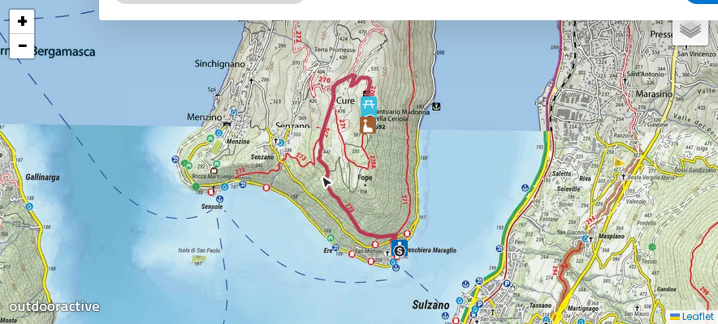
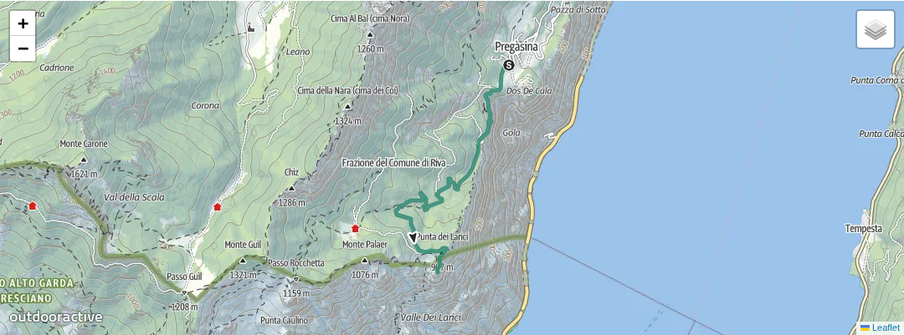
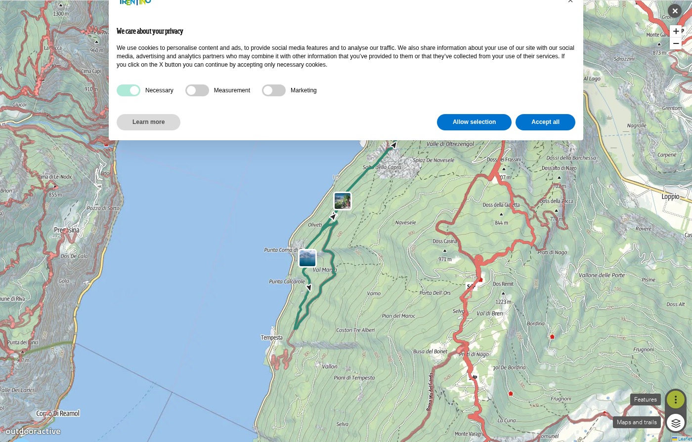
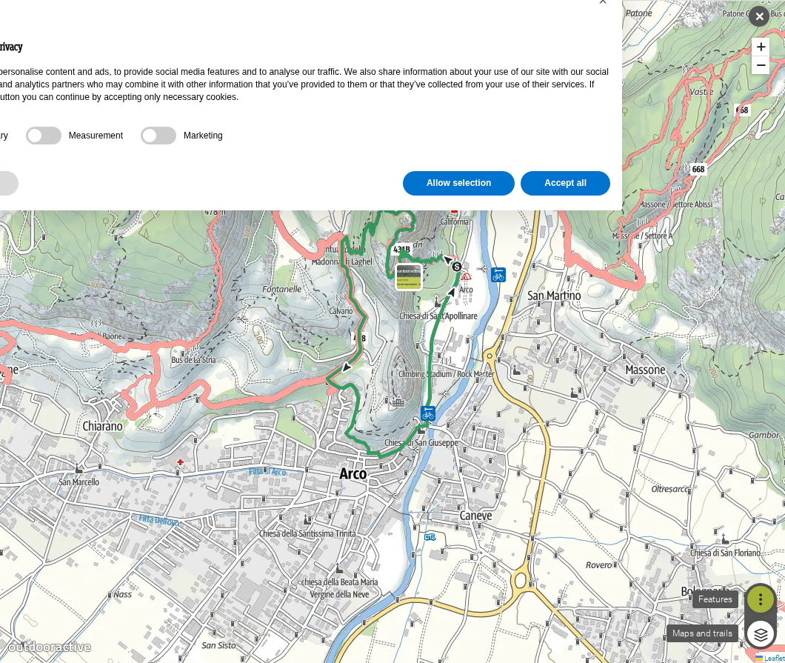
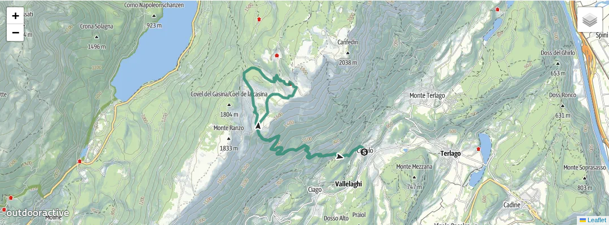

# Trip plan — Garda ↔ Iseo corridor (1 – 7 Sep 2026)

7-day **mountain-first** camping loop from **Bergamo Airport (BGY)** through **Lake Iseo**, **Riva del Garda**, **Arco**, and **Valle dei Laghi**.

**Travellers:** 5 people, tent(s) + rental car (estate/SUV).

**Driving rule:** **≤100 km per calendar day** on move days. Two long legs (~99 km) link Iseo and Riva; all other days are short or day trips from a fixed camp.

**Camps:** **two sites only** — **Camping del Sole** (Iseo, nights 1–2) and **Camping Brione** (Riva, nights 3–6). No daily camp moves after the transfer day.

**Activity rules:** [PRINCIPLES.md](../PRINCIPLES.md) — mountain every day; lake swim only as **recovery** after hikes or transfers.

**Budget:** [BUDGET.md](BUDGET.md) — **~€900–1,450** excl. flights (7 days, 5 people).

**Equipment:** [../version-a/EQUIPMENT.md](../version-a/EQUIPMENT.md) — hiking kit + **via ferrata set** for Day 5 (Colodri).

**Distances:** [RESEARCH.md](RESEARCH.md).

**Continue to Dolomites?** See [README — How this fits](README.md#how-this-fits-the-other-plans) or join [Version A](../version-a/PLAN.md) via Bressanone staging (~98 km from Sarche).

---

## Calendar

| Day | Date | Overnight | Main activity | Drive (km) |
|-----|------|-----------|---------------|------------|
| 1 | **Tue 1 Sep** | **Camping del Sole**, Iseo | Arrive BGY → camp | **~26** |
| 2 | **Wed 2 Sep** | **Camping del Sole**, Iseo | **Monte Isola** — Ceriola sanctuary | **~0–15** local |
| 3 | **Thu 3 Sep** | **Camping Brione**, Riva | Transfer Iseo → Riva | **~99** |
| 4 | **Fri 4 Sep** | **Camping Brione**, Riva | **Punta Larici** viewpoint | **~0–10** local |
| 5 | **Sat 5 Sep** | **Camping Brione**, Riva | **Busatte–Tempesta** + **Via Ferrata Colodri** | **~0–16** local |
| 6 | **Sun 6 Sep** | **Camping Brione**, Riva | **Covelo → Bait del Germano** (Valle dei Laghi) | **~30–35** RT |
| 7 | **Mon 7 Sep** | — | Return to Iseo / BGY | **~99** + **~26** |

**Camping nights:** 6 (2 × Iseo + 4 × Riva).

---

## Corridor map

```
BGY ──26km──► ISEO (del Sole) ───────── 99 km ─────────► RIVA (Brione) ── base for days 4–6
                │                                              │
                │ Day 2: Monte Isola (ferry)                   ├── Punta Larici, Busatte, Colodri
                │                                              └── Valle dei Laghi (~30–35 km RT)
                │
                └──────────────── 99 km ───────────────────────► return leg (day 7)
                                              │
                                              └──► optional: A22 north → Dolomites
```

---

## Day 1 — Tue 1 Sep: Arrival at Lake Iseo

### Mountain

| Time | Activity |
|------|----------|
| Morning / midday | Land BGY, collect rental car — [car hire guide](../version-a/BUDGET.md#1-car-hire--bergamo-bgy--local-alternatives) |
| Afternoon | Drive to **Camping del Sole** (**~26 km**, A4 Rovato exit), pitch tent |

No mountain route today — travel day only.

### Recovery

| Time | Activity |
|------|----------|
| Late afternoon | Optional **swim** at del Sole lakeside beach (~30 min) |

### Logistics

| Time | Activity |
|------|----------|
| Evening | **Provision run** — supermarket in Iseo (~20 min) for days 1–3 |

### Costs today

| Item | € |
|------|---|
| Car hire (daily share) | ~€20–50 |
| Campsite night 1 | ~€50–80 |

### Watch

- Valley altitude ~200 m — save legs for **Monte Isola** tomorrow.
- **Same camp two nights** — settle in without repacking.

**Camp:** [Camping del Sole](https://www.campingdelsole.it/en/)

---

## Day 2 — Wed 2 Sep: Monte Isola — Madonna della Ceriola

### Mountain

| Time | Activity |
|------|----------|
| 08:30 | Drive to **Sulzano** (~10 km), ferry to **Peschiera Maraglio** |
| 09:00–13:00 | Hike path **1** to **Madonna della Ceriola** (~3 km up, **+400 m**, 360° lake views) |
| 13:30 | Ferry back to Sulzano |

**Fallback:** **Corna del Trento** from Piani di Clanezzo if ferry weather cancels — see [RESEARCH.md](RESEARCH.md).

**Route map (marked trail):** [Visit Lake Iseo — interactive map](https://visitlakeiseo.info/en/sport-and-adventure/trekking-from-peschiera-maraglio-to-the-ceriola-sanctuary/) · [full hike notes + map screenshot](RESEARCH.md#monte-isola--madonna-della-ceriola-day-2-iseo-base)



### Recovery

| Time | Activity |
|------|----------|
| 17:00 | **Swim** at del Sole beach after the hike |

### Logistics

| Time | Activity |
|------|----------|
| Evening | Pack for **long transfer tomorrow** (~99 km) |

### Costs today

| Item | € |
|------|---|
| Campsite night 2 | ~€50–80 |
| Ferry return (×5) | ~€15–25 |

### Watch

- Check [ferry timetable](https://www.navigazione.lake-iseo.com/) — allow time for last boat back.
- Moderate climb — hiking boots, water, layers for summit wind.

**Camp:** [Camping del Sole](https://www.campingdelsole.it/en/)

---

## Day 3 — Thu 3 Sep: Iseo → Riva del Garda

### Mountain

Transfer day — no dedicated hike.

### Recovery

| Time | Activity |
|------|----------|
| Midday | Check in **Camping Brione** |
| 15:00 | **Swim** at Brione beach after the drive (~99 km) |

### Logistics

| Time | Activity |
|------|----------|
| 08:00 | Pack camp, leave Iseo |
| 10:00–10:30 | Arrive Brione (via Brescia / Salò / Gardesana) |
| Evening | Light camp dinner — save energy for **Punta Larici** tomorrow |

### Costs today

| Item | € |
|------|---|
| Motorway / tolls | ~€12–18 |
| Fuel | ~€15–22 |
| Campsite night 3 | ~€55–85 |

### Watch

- **Longest driving day** — start early, fuel before leaving Iseo area.
- Four nights at Brione — pitch properly; no more camp moves until departure.

**Camp:** [Camping Brione](https://www.campingbrione.com/EN/)

---

## Day 4 — Fri 4 Sep: Punta Larici

### Mountain

| Time | Activity |
|------|----------|
| 08:00 | Drive to **Pregasina** (~10 km from Brione) |
| 08:30–12:00 | **Punta Larici** from Pregasina (~3.2 km, **+367 m**, ~1 h 45 min) — iconic Garda viewpoint |
| 12:30 | Return to camp |

**Sources:** [Garda Trentino — Punta Larici](https://www.gardatrentino.it/en/activity/punta-larici-the-most-spectacular-lookout-point-on-lake-garda_8491)

**Route map (marked trail):** [Garda Trentino — interactive map](https://www.gardatrentino.it/en/activity/punta-larici-the-most-spectacular-lookout-point-on-lake-garda_8491)



### Recovery

| Time | Activity |
|------|----------|
| 17:00 | **Swim** at Brione beach |

### Logistics

| Time | Activity |
|------|----------|
| Evening | Rest — early start for **Busatte** + **Colodri** tomorrow; **rent ferrata kit in Arco** unless bringing own ([Appendix A](../version-a/EQUIPMENT.md#appendix-a--optional-buying-ferrata-kits-in-poland)) |

### Costs today

| Item | € |
|------|---|
| Campsite night 4 | ~€55–85 |

### Watch

- Exposed sections on SAT 422A — vertigo-sensitive hikers use forest path SAT 422 ([RESEARCH.md](RESEARCH.md)).
- Rest legs tonight — Day 5 is the hardest combo day.

**Camp:** [Camping Brione](https://www.campingbrione.com/EN/)

---

## Day 5 — Sat 5 Sep: Busatte–Tempesta + Via Ferrata Colodri

### Mountain

| Time | Activity |
|------|----------|
| 07:30 | Drive to **Busatte Adventure Park**, Torbole (~15 min) |
| 08:00–12:00 | **Busatte–Tempesta** panoramic path (~10 km, 400 iron steps) |
| 13:00 | Pick up ferrata kit in **Arco** ([Mmove ~€16/day/set](https://360gardalife.com/en/activities/tours-excursions/viaferrata/colodri-lake-garda-alpine-guide-mmove/)) **or use kits brought from Poland** |
| 14:00–17:00 | **Via Ferrata Colodri** — Prabi trailhead (~8 km from Brione), grade A–B, ~3–4 h total |

**Weather backup:** **Via Ferrata Rio Sallagoni** (canyon, easy) if Colodri is wet — [360gardalife](https://360gardalife.com/en/activities/tours-excursions/viaferrata/).

**Route maps (marked trails):**

| Route | Interactive map |
|-------|-----------------|
| Busatte–Tempesta | [Visit Trentino](https://www.visittrentino.info/en/guide/tour/sentiero-busatte-tempesta_tour_1553752#dm=1) |
| Via Ferrata Colodri | [Visit Trentino](https://www.visittrentino.info/en/guide/tour/via-ferrata-colodri-colt_tour_8279464#dm=1) |





### Recovery

| Time | Activity |
|------|----------|
| 17:30 | **Swim** at Brione beach |

### Logistics

| Time | Activity |
|------|----------|
| Morning | Fuel top-up if needed (~€3–5 local) |

### Costs today

| Item | € |
|------|---|
| Campsite night 5 | ~€55–85 |
| Ferrata kit rental (×5) | ~€80–135 | €0 if [own kits from PL](../version-a/EQUIPMENT.md#appendix-a--optional-buying-ferrata-kits-in-poland) |

### Watch

- **Busatte steps:** hot metal in afternoon sun — start **before 09:00**.
- **Colodri:** sunny east face — no ferrata if thunderstorms forecast after 12:00.
- First ferrata for the group — read [EQUIPMENT.md](../version-a/EQUIPMENT.md) kit list.

**Camp:** [Camping Brione](https://www.campingbrione.com/EN/)

---

## Day 6 — Sun 6 Sep: Valle dei Laghi — Covelo loop

### Mountain

| Time | Activity |
|------|----------|
| 08:30 | Drive Riva → **Covelo** / Sarche area (**~30–35 km** RT via Dro / SS45bis) |
| 09:00–14:00 | **Covelo → Bait del Germano** (~14 km, hilly, four-lake views) |
| 14:30 | Return toward Riva |

**Alternative:** **Seven Lakes stage I** (Sarche → Monte Terlago, ~14 km) if you prefer — [Outdooractive](https://www.outdooractive.com/en/route/pilgrim-walk/garda-trentino/seven-lakes-route-stage-i-sarche-monte-terlago/312259126/).

**Route map (marked trail):** [Garda Trentino — Covelo → Bait del Germano](https://www.gardatrentino.it/en/activity/covelo-bait-del-germano_45307)



### Recovery

| Time | Activity |
|------|----------|
| 17:00 | **Swim** at Brione — last camp night |

### Logistics

| Time | Activity |
|------|----------|
| En route | If joining Dolomites tomorrow: **provision stop** near Trento (~20 min) for mountain supplies |

### Costs today

| Item | € |
|------|---|
| Campsite night 6 | ~€55–85 |
| Fuel | ~€8–12 |

### Watch

- Gateway to **A22** — Option C on Day 7 continues north toward Bressanone.

**Camp:** [Camping Brione](https://www.campingbrione.com/EN/)

---

## Day 7 — Mon 7 Sep: Return to Iseo & departure

### Logistics

| Time | Activity |
|------|----------|
| 08:00 | Pack camp, leave Riva |
| 10:00–10:30 | Arrive **Iseo** area (**~99 km**) |
| Option A | Same-day **Iseo → BGY (~26 km)** + afternoon flight |
| Option B | Extra night at Camping del Sole; fly **Tue 8 Sep** |
| Option C | **Continue north** — Riva/Sarche → Bressanone (~98 km) tomorrow; join [Version A Dolomites](../version-a/PLAN.md) |

### Costs today

| Item | € |
|------|---|
| Fuel + tolls | ~€25–35 |
| Car hire (final day) | included in 7-day rental |

---

## Activity summary

| Activity | Date | Type | From camp |
|----------|------|------|-----------|
| Monte Isola — Ceriola | 2 Sep | Summit hike (+400 m) | ferry from Sulzano |
| Punta Larici | 4 Sep | Viewpoint hike (+367 m) | ~10 km drive |
| Busatte–Tempesta | 5 Sep | Scenic hike (~10 km) | ~15 km drive |
| Via Ferrata Colodri | 5 Sep | Ferrata A–B | ~8 km drive |
| Covelo → Bait del Germano | 6 Sep | Hill walk (~14 km) | ~30–35 km RT drive |

---

## Booking checklist

| ☐ | Item | When | Link | Cost |
|---|------|------|------|------|
| ☐ | Car hire (7 days, estate/SUV) | ASAP | [Version A car hire guide](../version-a/BUDGET.md#1-car-hire--bergamo-bgy--local-alternatives) | €200–490 |
| ☐ | Camping del Sole (1–2 Sep, 2 nights) | ASAP | [campingdelsole.it](https://www.campingdelsole.it/en/) | ~€100–160 |
| ☐ | Camping Brione (3–6 Sep, 4 nights) | ASAP | [campingbrione.com](https://www.campingbrione.com/EN/) | ~€220–340 |
| ☐ | Ferrata kit (5 Sep, ×5) | Before trip **or** rent in Arco | [Buy in PL — Appendix A](../version-a/EQUIPMENT.md#appendix-a--optional-buying-ferrata-kits-in-poland) · [Mmove Arco](https://360gardalife.com/en/activities/tours-excursions/viaferrata/colodri-lake-garda-alpine-guide-mmove/) | €0 (owned) or ~€80–135 |

---

## Suggested pre-trip viewing

1. [Monte Isola — Ceriola trek](https://visitlakeiseo.info/en/sport-and-adventure/trekking-from-peschiera-maraglio-to-the-ceriola-sanctuary/)
2. [Busatte–Tempesta — Trentino.com](https://www.trentino.com/en/leisure-activities/mountains-and-hiking/hiking-in-spring/busatte-tempesta-panorama-path/)
3. [Via Ferrata Colodri — Visit Trentino](https://www.visittrentino.info/en/guide/tour/via-ferrata-colodri-colt_tour_8279464)

Full research: [RESEARCH.md](RESEARCH.md).
