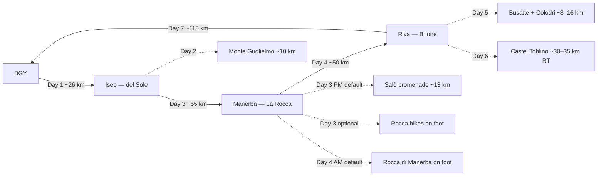

# Trip plan — Budget Garda corridor (1 – 7 Sep 2026)

7-day camping loop from **Bergamo Airport (BGY)** through **Lake Iseo**, **Manerba del Garda / Salò** (west Garda), **Riva del Garda**, **Arco**, and **Valle dei Laghi** (Lago Toblino).

**Travellers:** 5 people, tent(s) + rental car (estate/SUV).

**Driving rule:** **≤100 km per calendar day** on move days. Iseo→Riva is split over two days (~55 + ~50 km); return to BGY is direct from Riva.

**Camps:** **three sites** — **Camping del Sole** (Iseo, nights 1–2), **Camping La Rocca** (Manerba, night 3), **Camping Brione** (Riva, nights 4–6).

**Budget:** [BUDGET.md](BUDGET.md) — **~€997–1,837** excl. flights (7 days, 5 people).

**Equipment:** [../version-a/EQUIPMENT.md](../version-a/EQUIPMENT.md) — hiking kit + thin gloves for Day 5 ferrata; rent harness/helmet/lanyard locally.

**Distances:** [RESEARCH.md](RESEARCH.md).

**Continue to Dolomites?** See [README — How this fits](README.md#how-this-fits-the-other-plans) or join [Version A](../version-a/PLAN.md) via Bressanone staging (~98 km from Sarche).

---

## Calendar

| Day | Date | Overnight | Main activity | Drive (km) |
|-----|------|-----------|---------------|------------|
| 1 | **Tue 1 Sep** | **Camping del Sole**, Iseo | Arrive BGY → lake | **~26** |
| 2 | **Wed 2 Sep** | **Camping del Sole**, Iseo | **Monte Guglielmo** hike | **~0–15** local |
| 3 | **Thu 3 Sep** | **Camping La Rocca**, Manerba | Iseo → west Garda; **Salò** promenade *(or [Rocca hikes — optional](OPTIONAL-la-rocca-hiking-day.md))* | **~55** |
| 4 | **Fri 4 Sep** | **Camping Brione**, Riva | **Rocca di Manerba** AM *(skip if optional Day 3)* → Riva waterfront PM | **~50** |
| 5 | **Sat 5 Sep** | **Camping Brione**, Riva | Busatte–Tempesta + **Via Ferrata Colodri** | **~0–16** local |
| 6 | **Sun 6 Sep** | **Camping Brione**, Riva | Valle dei Laghi — Castel Toblino (day trip) | **~30–35** RT |
| 7 | **Mon 7 Sep** | — | Riva → BGY direct | **~115** |

**Camping nights:** 6 (2 × Iseo + 1 × Manerba + 3 × Riva).

---

## Corridor map

---

## Day 1 — Tue 1 Sep: Arrival at Lake Iseo

### Schedule

| Time | Activity |
|------|----------|
| Morning / midday | Land BGY, collect rental car — [car hire guide](../version-a/BUDGET.md#1-car-hire--bergamo-bgy--local-alternatives) |
| Afternoon | Drive to **Camping del Sole** (**~26 km**, A4 Rovato exit) |
| Late afternoon | Easy **lakeshore walk** in Iseo town |
| Evening | **Supermarket shop** in Iseo — stock up for Days 1–3 (see [Camp kitchen](#camp-kitchen-budget)) |

### Costs today

| Item | € |
|------|---|
| Car hire (daily share) | ~€20–50 |
| Campsite night 1 | ~€50–80 |
| Groceries (first stock-up) | ~€40–70 |

### Watch

- Valley altitude ~200 m — no mountain exertion after travel.
- **Tomorrow is a full hiking day** at the same camp — pack lunch tonight.

**Camp:** [Camping del Sole](https://www.campingdelsole.it/en/)

---

## Day 2 — Wed 2 Sep: Monte Guglielmo (same camp)

### Schedule

| Time | Activity |
|------|----------|
| 07:30 | Drive to **Pescegallo / Castro** trailhead (**~10 km** from camp) |
| Morning–afternoon | **Monte Guglielmo** via Rifugio Guglielmo — **~12–14 km**, **+1,100 m**, **5–6 h**; 360° views over Iseo and the Bergamo Alps |
| Late afternoon | Swim at camp beach **OR** short **Iseo → Sulzano** lakeshore walk (~8 km flat) if legs are done |
| Evening | Cook at camp; prep for transfer tomorrow (~55 km) — pack camp early |

**Easier fallback (same area):** **Corna Trentapassi** ridge — ~6–8 km, +500 m, still panoramic.

**Optional restaurant:** [Ristorante Il Cantuccio](https://www.tripadvisor.com/Restaurants-g194882-Iseo_Province_of_Brescia_Lombardy.html), Iseo — menu del giorno ~€18 (lake fish). See [Optional restaurants](#optional-restaurants-tripadvisor).

### Costs today

| Item | € |
|------|---|
| Campsite night 2 | ~€50–80 |
| Fuel (local) | ~€3–5 |

### Watch

- Start **early** — little shade on the upper ridge.
- Carry **2 L+ water** per person; do not rely on the refugio being open.
- Weather backup: flat **Sulzano promenade** + optional **Monte Isola ferry** from Sulzano (~€9–11 RT/person).

**Camp:** [Camping del Sole](https://www.campingdelsole.it/en/)

---

## Day 3 — Thu 3 Sep: Iseo → Manerba del Garda

### Schedule

| Time | Activity |
|------|----------|
| 08:00 | Pack camp, leave Iseo |
| 10:00–10:30 | Arrive **Camping La Rocca**, Manerba (**~55 km** via Brescia / Desenzano / Salò) |
| Midday | Check in, lake swim at camp |
| Afternoon | Drive to **Salò** (**~13 km**) — historic promenade, gelato, old-town stroll |
| Evening | Cook at camp **OR** optional dinner in Salò |

**Prefer hiking to town strolling?** Use **[OPTIONAL-la-rocca-hiking-day.md](OPTIONAL-la-rocca-hiking-day.md)** — Rocca reserve loops on foot from camp (Routes A–C); skip Salò and do the Rocca on Day 3 PM instead of Day 4 AM.

**Optional restaurant:** [Osteria di Mezzo](https://www.tripadvisor.co.uk/Restaurants-g644254-Salo_Province_of_Brescia_Lombardy.html), Salò — seasonal pasta, TripAdvisor top pick in Salò. See [Optional restaurants](#optional-restaurants-tripadvisor). *(Skip if using the optional hiking day.)*

### Costs today

| Item | € |
|------|---|
| Fuel | ~€10–15 |
| Campsite night 3 | ~€50–80 |

### Watch

- **West Garda** is warmer and more Mediterranean than Iseo — sunscreen for the afternoon.
- La Rocca sits at the **Rocca di Manerba** park trailhead — main plan hikes it **Day 4 AM**; [optional plan](OPTIONAL-la-rocca-hiking-day.md) moves it to **Day 3 PM**.
- One night only at Manerba — keep camp setup simple.

**Camp:** [Camping La Rocca](https://www.laroccacamp.it/)

---

## Day 4 — Fri 4 Sep: Rocca di Manerba → Riva del Garda

If you used **[OPTIONAL-la-rocca-hiking-day.md](OPTIONAL-la-rocca-hiking-day.md)** on Day 3, **skip the morning Rocca hike** below and leave Manerba at **08:00**.

### Schedule

| Time | Activity |
|------|----------|
| 07:30 | **Rocca di Manerba** loop through the nature reserve — **~4–8 km**, **+200–350 m**, **2–3 h**; cliff-top views over all of lower Garda *(main plan only)* |
| 10:30 | Pack camp, leave Manerba *(08:00 if optional Day 3 hiking)* |
| 12:00–12:30 | Arrive **Camping Brione**, Riva (**~50 km** along SS45bis Gardesana Occidentale) |
| Midday | Check in, lake swim |
| Afternoon | Easy **waterfront walk** Riva → Torbole |
| Evening | Cook at camp — save legs for Busatte and ferrata tomorrow |

### Costs today

| Item | € |
|------|---|
| Fuel | ~€10–15 |
| Campsite night 4 | ~€55–85 |

### Watch

- **Rocca trail** is exposed — start early; avoid if thunderstorms forecast.
- Gardesana road has **tunnels** — headlights on; can be slow in peak season (September is fine).
- You stay at Brione for **three nights** — pitch properly.

**Camp:** [Camping Brione](https://www.campingbrione.com/EN/)

---

## Day 5 — Sat 5 Sep: Busatte + Via Ferrata Colodri (same camp)

### Schedule

| Time | Activity |
|------|----------|
| 07:30 | **Busatte–Tempesta** panoramic path (~10 km, **400 iron steps**) — start early before heat on the steps |
| 12:00 | Lunch at camp |
| 14:00 | Drive to **Arco / Prabi** (**~8 km**) |
| Afternoon | **Via Ferrata Colodri** — cliff route **300 m above Lake Garda** (~3–4 h total, grade A–B) |
| Evening | Optional stroll in **Arco** old town (free) |

### Via Ferrata Colodri — main “crazy” activity

| | |
|---|---|
| **Grade** | Easy / A–B |
| **Duration** | ~1 h on wire; 3–4 h total |
| **Start** | Car park at Camping Arco Prabi, Prabi (**~8 km** from Brione) — [Visit Trentino](https://www.visittrentino.info/en/guide/tour/via-ferrata-colodri-colt_tour_8279464) |
| **Gear** | Rent in Arco — [Mmove kit ~€16/day](https://360gardalife.com/en/activities/tours-excursions/viaferrata/colodri-lake-garda-alpine-guide-mmove/) |
| **Who goes** | Not everyone has to climb — 2–3 on the wire; others do **Punta Larici** (~3 km, +367 m) or swim at camp |

**Optional restaurant:** [Osteria Degli Artisti](https://www.tripadvisor.com/Restaurants-g194883-Riva_Del_Garda_Province_of_Trento_Trentino_Alto_Adige.html), Riva — homemade pasta, fair prices (~€15–25/person). See [Optional restaurants](#optional-restaurants-tripadvisor).

### Costs today

| Item | € |
|------|---|
| Campsite night 5 | ~€55–85 |
| Ferrata kit × 5 (or × 2–3) | ~€32–80 |
| Fuel (local) | ~€3–5 |

### Watch

- **Busatte steps:** hot metal after 10:00 — do Busatte first.
- **Colodri:** dry weather only; vertigo-sensitive people skip it. Bring thin gloves.
- Weather backup: see [Appendix — Rio Sallagoni](#appendix--weather-backup-via-ferrata-rio-sallagoni).

**Camp:** [Camping Brione](https://www.campingbrione.com/EN/)

---

## Day 6 — Sun 6 Sep: Valle dei Laghi day trip (same camp)

### Schedule

| Time | Activity |
|------|----------|
| 09:00 | Drive Riva → **Castel Toblino** area (**~30–35 km** RT via Dro / SS45bis) |
| Morning | **Castel Toblino** lakeshore walk (~5–8 km, flat) |
| Afternoon | **Seven Lakes** stage I toward Monte Terlago (~14 km, hilly) **OR** short Covelo viewpoint hike |
| 17:00 | Return to Brione for last camp night; optional supermarket in Riva or Trento |

### Costs today

| Item | € |
|------|---|
| Campsite night 6 | ~€55–85 |
| Fuel | ~€8–12 |

### Watch

- Gateway to **A22** — if joining Dolomites tomorrow, shop in **Trento** (20 min from Toblino) for mountain supplies.
- Good day for **pesto pasta** at camp tonight — see [Camp kitchen](#camp-kitchen-budget).

**Camp:** [Camping Brione](https://www.campingbrione.com/EN/)

---

## Day 7 — Mon 7 Sep: Return to BGY

### Schedule

| Time | Activity |
|------|----------|
| 08:00 | Pack camp, leave Riva |
| 10:30–11:00 | Arrive **BGY** (**~115 km** via SS240 → A22 → Brescia → A4) |
| Midday | Drop rental car, fly out |

**Why not via Iseo?** Direct Riva → BGY saves repeating the 99 km Iseo leg. You already had two full Iseo days.

### Options after Day 6

| Option | What |
|--------|------|
| **A** | Fly home Mon 7 Sep (this plan) |
| **B** | **Continue north** — Riva/Sarche → Bressanone (~98 km) Tue 8 Sep; join [Version A Dolomites](../version-a/PLAN.md) |

### Costs today

| Item | € |
|------|---|
| Fuel | ~€18–28 |
| Motorway / tolls | ~€8–15 |
| Car hire (final day) | included in 7-day rental |

---

## Camp kitchen (budget)

Cook **4–5 dinners** at camp; use optional restaurants on 1–2 nights. For 5 people, one gas stove + campfire (where allowed).

| Meal | Idea | Shop where |
|------|------|------------|
| Breakfast | Muesli + UHT milk, fruit, coffee (moka) | Iseo / Riva supermarket |
| Lunch (trail) | Pane + salame/coppa, apples, refill water | Stock up Day 1 at Iseo |
| Dinner 1 (Day 1) | **Pasta aglio e olio** + insalata | Iseo — cheap, one pot |
| Dinner 2 (Day 2) | **Polenta** (instant) + grilled zucchini + scamorza | Iseo camp |
| Dinner 3 (Day 3) | **Risotto** with frozen peas / stock cubes | Manerba camp market |
| Dinner 4 (Day 4) | **Caprese** (tomato, mozzarella, basil) + bread | Riva — shop on arrival |
| Dinner 5 (Day 5) | **One-pot lentil soup** + leftover pasta | Riva |
| Dinner 6 (Day 6) | **Pesto pasta** + cherry tomatoes | Riva / Trento stop on Toblino day |
| Snacks | Local cheese (Grana, Formaggella); wine €3–6 from discount aisle | Conad / Eurospin / Esselunga |

**Rule of thumb:** **4 dinners cooked, 2 optional restaurant** keeps food spend near the low end of [BUDGET.md](BUDGET.md).

**Supermarket stops:** Iseo (Days 1–2) → Manerba/Salò (Day 3) → Riva (Days 4–6) → Trento (Day 6, optional).

---

## Optional restaurants (TripAdvisor)

Not included in base budget — pick 1–2 for a treat.

| Day | Restaurant | Why | Link | Est. €/person |
|-----|------------|-----|------|---------------|
| 2 | **Ristorante Il Cantuccio**, Iseo | Menu del giorno ~€18, lake fish, central | [TripAdvisor Iseo](https://www.tripadvisor.com/Restaurants-g194882-Iseo_Province_of_Brescia_Lombardy.html) | €18–25 |
| 3 | **Osteria di Mezzo**, Salò | Seasonal pasta, rustic charm — top Salò pick | [TripAdvisor Salò](https://www.tripadvisor.co.uk/Restaurants-g644254-Salo_Province_of_Brescia_Lombardy.html) | €25–35 |
| 5 or 6 | **Osteria Degli Artisti**, Riva | Homemade pasta, fair prices, ~4.5★ | [TripAdvisor Riva](https://www.tripadvisor.com/Restaurants-g194883-Riva_Del_Garda_Province_of_Trento_Trentino_Alto_Adige.html) | €15–25 |

Remember **pane e coperto** (bread/cover charge, ~€2–3/person) on restaurant bills.

---

## Activity summary

| Activity | Date | Type | From camp |
|----------|------|------|-----------|
| Iseo lakeshore | 1 Sep | Easy walk | on foot |
| **Monte Guglielmo** | 2 Sep | Full-day mountain hike | ~10 km drive |
| Salò promenade | 3 Sep | Town / lake *(main plan)* | ~13 km from Manerba |
| **Rocca di Manerba** | 3 or 4 Sep | Viewpoint / nature reserve | on foot from La Rocca — [optional Day 3 plan](OPTIONAL-la-rocca-hiking-day.md) |
| Riva waterfront | 4 Sep | Lake walk | on foot |
| **Busatte–Tempesta** | 5 Sep | Scenic hike (400 steps) | ~15 min drive |
| **Via Ferrata Colodri** | 5 Sep | Cliff ferrata (grade A–B) | ~8 km |
| Punta Larici (optional) | 5 Sep | Viewpoint | ~10 km from Brione |
| Castel Toblino / Valle dei Laghi | 6 Sep | Lake / hill walk | ~30–35 km RT drive |

---

## Booking checklist

| ☐ | Item | When | Link | Cost |
|---|------|------|------|------|
| ☐ | Car hire (7 days, estate/SUV) | ASAP | [Version A car hire guide](../version-a/BUDGET.md#1-car-hire--bergamo-bgy--local-alternatives) | €200–490 |
| ☐ | Camping del Sole (1–2 Sep, 2 nights) | ASAP | [campingdelsole.it](https://www.campingdelsole.it/en/) | ~€100–160 |
| ☐ | Camping La Rocca (3 Sep, 1 night) | ASAP | [laroccacamp.it](https://www.laroccacamp.it/) | ~€50–80 |
| ☐ | Camping Brione (4–6 Sep, 3 nights) | ASAP | [campingbrione.com](https://www.campingbrione.com/EN/) | ~€165–255 |
| ☐ | Ferrata kit × 5 sets (Day 5) | 1–2 weeks before | [Mmove Arco](https://360gardalife.com/en/activities/tours-excursions/viaferrata/colodri-lake-garda-alpine-guide-mmove/) | ~€16/person |

---

## Suggested pre-trip viewing

1. [Busatte–Tempesta — Trentino.com](https://www.trentino.com/en/leisure-activities/mountains-and-hiking/hiking-in-spring/busatte-tempesta-panorama-path/)
2. [Via Ferrata Colodri — Visit Trentino](https://www.visittrentino.info/en/guide/tour/via-ferrata-colodri-colt_tour_8279464)
3. [Brooke Beyond — beginner ferrata guide](https://brookebeyond.com/via-ferrata-in-the-italian-dolomites)
4. [Rocca di Manerba — Visit Manerba](https://visitmanerba.it/)

Full research: [RESEARCH.md](RESEARCH.md).

---

## Appendix — Optional Day 3: La Rocca hiking (no towns)

Skip **Salò** and hike **Parco della Rocca e del Sasso** on foot from camp on Day 3 afternoon instead of Day 4 morning.

→ Full schedule, three route options (A/B/C), and Day 4 adjustment: **[OPTIONAL-la-rocca-hiking-day.md](OPTIONAL-la-rocca-hiking-day.md)**

---

## Appendix — Weather backup: Via Ferrata Rio Sallagoni

If Colodri is wet or the group prefers a shorter canyon route, swap the afternoon ferrata on **Day 5**.

| | |
|---|---|
| **Grade** | Easy — short canyon ferrata near Arco |
| **Duration** | ~2–3 h total |
| **Gear** | Same kit rental as Colodri in Arco — [360gardalife](https://360gardalife.com/en/activities/tours-excursions/viaferrata/) |
| **When** | Better in overcast/cool conditions than Colodri’s exposed east face |

**Cheaper backup (no ferrata):** **Grotta Cascata Varone** — waterfall inside a cave, **€7/person**, **~12 km** from Brione — [cascata-varone.com](https://www.cascata-varone.com/en/).

**Suggested viewing:** [Via Ferrata Colodri — Visit Trentino](https://www.visittrentino.info/en/guide/tour/via-ferrata-colodri-colt_tour_8279464) · [Brooke Beyond — beginner ferrata guide](https://brookebeyond.com/via-ferrata-in-the-italian-dolomites)
